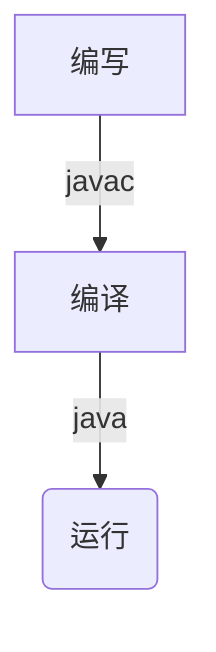
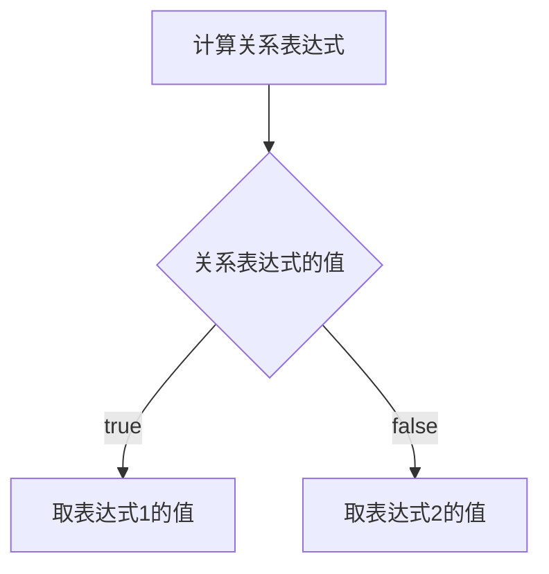

[toc]
# JAVA基础导学
目标：后台管理系统、文件的读写
案例：猜数、学生/老师信息管理系统
# JAVA基础语法
## 环境搭建+入门
内容：跨平台、JRE JKD JVM、下载安装、DOS命令、环境变量、简单代码实现、NOTEPAD、注释、关键词
平台（操作系统：WIN\ MAC\ LINUX）
### 跨平台属性
JAVA程序可以在任意操作系统上运行
原理：在不同平台上安装一个与平台对应的JAVA虚拟机（**JVM**: JAVA VIRTUAL MACHINE）

JVM本身不可以跨平台
### JAVA程序开发步骤

编写：

* **JRE**(JAVA RUNTIME ENVIRONMENT, 包含虚拟机和JAVA核心类库)
* 类：JAVA文件在代码中的几种体现（类=JAVA文件，一个Java文件，一个Java类）
* 类库：存放多个Java文件的仓库
* 核心类库：Java已经写好的，非常核心的代码仓库，存放在JRE中，在外面写代码时会被用到

编译：javac

* .java为源文件，无法被JVM所识别执行
* 翻译工具：**JDK**(JAVA DEVELOPMENT KIT)
* 编译成功会产生一个.class文件，这个文件可以被JVM识别执行

运行：JDK运行工具，运行在JVM中

### JAVA发展史

### JAVA安装

WIN+R CMD 或
在目标文件夹的路径栏输入CMD

常用DOS命令

### 环境变量的配置
配置原因：Java文件和Java程序安装的位置不同
方式：

### hello, world!
区分大小写
编译 JAVAC
运行
JAVA

如果不加public的话，文件名好class名可以不一致；但如果加了public的话就得一致（不然会报错）。
### 注释
* 单行注释 //
* 多行注释 /*    */ 
* 文档注释 /**      */
### 关键词

1. 关键词字母全是小写
2. 代码编辑器里对关键词有特殊的颜色标记
*main不是关键词，但也非常关键，相当于程序的入口识别

## 数据类型及转换
内容：常量、变量、数据类型、键盘录入、标识符、类型转换
### 常量
代码执行过程中，值不会发生改变的量

* 字符串常量 双引号
* 整数常量
* 小数常量
* 字符常量 单引号（单个字符）
* 布尔常量 true or false
* 空常量 null

### 变量
经常发生改变的值

变量就是内存中的存储空间，空间中存储着经常发生改变的量（数据）
数据类型 变量名 = 数据值
### 基本数据类型

整数里常用int，小数里常用double

*不能重复定义变量，比如说下面这样写，程序就会报错
`int a = 2; int a = 3;`
*分号作为一条语句的结束（最后一条语句也要加分号）
*一条语句可以多个赋值，例如：
`int a = 1, b = 2, c = 3;`
*变量必须初始化
*float和long类型定义时必须加标识

*变量作用域：所在的大括号里
### 键盘录入
S1 导包 `import java.util.Scanner;`
S2 创建对象 `Scanner sc = new Scanner(System.in);`
S3 使用变量接受数据 `int a = sc.nextInt();`

### 标识符
自己起的名字
* 由数字、字母、下划线_、美元符$组成
* 不能由数字开头、不能是关键词、区分大小写
常见的命名约定：（小驼峰大驼峰）

### 类型转换

隐式转换（小精度——>高精度）
`int a = 10;
float b = a;`
强制转换（高精度——>小精度）（直接丢掉小数部分，不进行四舍五入的转换）
`int a = 10;
byte b = (byte)a;`

**整数常量默认为int类型**
## 运算符
运算优先级：算术运算符>比较运算符>赋值运算符>逻辑运算符>三元运算符
### 算数运算符
运算符：对常量或变量进行操作的符号
表达式：用运算符把常量或变量连接起来符合语法的式子

int相除得到整数
如果要有小数的话得有float型参与运算
### 字符的运算
ASCII码表：字节-字符的对应关系

码表不用全记，着重记忆：

a+1 ----> 98
### 字符串的运算
加运算（相当于连接符而非运算符）

### 数值拆分

### 自增自减、赋值运算
a++,   ++a
b--,      --b

++在后：先运行程序操作，再自增
++在前：先自增，再运行程序操作
只能对变量进行操作，不能对常量进行操作

+= -+ *= /=（这里就不用强转了，也不会报错）

### 关系运算符、逻辑运算符
关系运算符返回结果只有true or false

### 三元运算符
格式：关系表达式?表达式1: 表达式2
执行流程：

## 条件控制语句
流程控制语句：通过一些语句来控制程序的**执行流程**
* 顺序结构：代码先后顺序依次执行
* 分支结构（if, switch）
* 循环结构(for, while, do...while)
### if语句
格式1：
    if(关系表达式){
        语句体;
        }
* 如果语句体只有一句，大括号可以省略（但不建议）
* 关系表达式后面不要加分号;，小括号大括号中间也不要加分号;

格式2：
    if(关系表达式){
        语句体;}else{
        语句体2;
        }
格式3：
    if(关系表达式){
        语句体;}else if{
        语句体2;
        }else if{
        语句体3;}else{
        语句体4;}
### switch语句

* case后面给的值不能重复，且只能是常量不能是变量

代码优化：case穿透
（我感觉没啥用，省略break只会一直运行下去（不管是否等于case的值）直到碰到break；整个就会变得很混乱，失去选择/开关功能）

在输出是相同的case上，可以适当省略代码。
## 循环
### for循环

关于打印: println是打印一行，print就是打印（不换行，无隔开）
### while循环

不确定循环次数时常用while循环
### do...while循环

不管条件是否满足，都会至少执行一次循环。
### 三种循环的对比、区别及应用场景
**for循环**
先判断后执行
for循环里定义的参数在结束循环后会消失
有明确的循环次数

**while循环**
先判断后执行
因为计数参数在循环外定义，所以循环结束后不会消失
无明确的循环次数

**do...while循环**
先执行后判断
很少用
### 死循环
ctrl+c强制停止循环 或 直接关掉cmd运行窗
应用场景例子：
键盘录入1-100之间的整数
顾虑：用户手动输入可能会产生错误
### 跳转控制语句
**continue**：跳过本次循环
**break**：结束整个循环
循环标号

## Random

## IDEA概述和安装
IntelliJ IDEA，业界公认目前JAVA开发最好的工具

### 操作步骤

编译自动完成，直接运行看结果就行

### 快捷键
**psvm enter**
public static void main(String[] args) {    }

**sout enter**
System.out.println();

**alt + 1**
目录

**alt + 4**
控制台

### IDEA操作项目和模块

## array数组
数组--存同种数据类型
数组类型和存储的数据类型保持一致
### 数组定义
格式一
数据类型[] 变量名
int[] array
格式二
数据类型 变量名[]
int array[]

空数组不能打印，得给它赋值。
### 数组初始化
**动态初始化**
数据类型[] 变量名 = new 数据类型[数组长度];
int[] arr = new int[3];

运行结果：内存地址

数组里的元素初始为零。

**静态初始化**
静态初始化：初始化时，就可以制订数组要存储的元素，系统还会自动计算出数组的长度。
格式：
数据类型[] 变量名 = new 数据类型[]{数据1，数据2，数据3，……};
int[] arr = new int[]{1,2,3,4,5};
或
数据类型[] 变量名 = {数据1，数据2，数据3，……};
int[] arr = {1,2,3,4,5};

| 初始化类型 | 特点 |
| --- | --- |
| 动态 | 明确数据个数，不明确具体数据 |
| 静态 | 已经明确具体数据 |

### 索引
* 从0开始
* 索引连续
* 逐一增加，每次加1
### 内存分配

两个数组内存图

多数组指向相同内存图

### 常见问题
**索引越界**
访问了不存在的索引

**空指针**

### 遍历（取出数组所有数据）
动态获取数组元素个数
数组名.length
arr.length
### 二维数组

## 方法method和debug
内容：定义和调用，形参和实参，返回值，通用格式，重载，参数传递，debug。
方法（method）:一段具有独立功能的代码块，不调用就不执行。（JAVA里没有函数，方法就是函数的作用）

* 方法必须先创建才可以使用，该过程成为方法的定义
* 方法创建后并不是直接运行，需要手动使用后再执行，该过程成为方法的调用
* 方法不能嵌套使用
* 方法返回值为void代表没有返回值
* return之后的代码不执行（方法结束/弹栈）

定义在public static void main之外，public class内。
* 方法没有被调用的时候，都在方法区中的字节码文件（.class）中存储
* 方法被调用的时候，需要进入到栈内存中运行（栈内存：先进后出）

### 参数的引入

形参：形式参数，指方法定义中的参数（指代的字母）
实参：实际参数，指方法调用中的参数（实际数字）
### 返回值

同时注意得有一个变量在main块里去接受return的值;
return只能返回一个结果，不过可以返回一个数组

### 重载
同一个class中可以存在同名的method（但不允许input也相同），通过参数的不同类型或参数个数或参数顺序来确定和选择不同的method。
包括打印这个method也是用了很多针对不同数据类型的重载。

### 参数传递
如果input是数组的一个值的话，修改之后对数组的值本身会改变
### debug
断点（鼠标左键点一下），debug模式运行。
## 进制
### 进制介绍
计算机数据在底层运算的时候都是以二进制。
**十进制**
逢十进一
**二进制**
0+1 逢二进一 
0011+1 = 0100

在jdk7版本之后是这样，之前可能会不一样。
### 进制转换

8421码

### 原码反码补码
计算机中的数据都是以二进制补码的形式在运算，而补码则是通过反码和源码推算出来的。
原码：可直观看出数据大小（看数据）
反码：（转数据）
补码：数据以该形态进行运算（运算数据）

### 位运算符

a ^ b ^ b = a

### 数据交换

# 面向对象
面向对象：以对象对中心，通过指挥对象实现具体的功能；
面向过程：以过程为中心，实现功能的每一步，都是自己实现的

类：类是对现实生活中一类具有共同属性和行为的事物的抽象（对对象的一种描述，可以将类理解为一张设计图；根据设计图，可以创建出具体存在的事物）
根据类去创建对象

## 类的组成：
* 属性（该事物的各种特征）
* 行为（该事物存在的功能，能够做的事情）

## 类和对象的关系
类：类是对现实生活中一类具有共同属性和行为的事物的抽象
对象：是能够看得到摸得着的真实存在的实体

类是对象的描述
对象是类的实体
## 类的定义

## 对象的创建和使用

对象的创建和类的定义不一定在同一个文件里进行
定义类后，所有的初始值都为0.
## 对象内存图
### 单个对象

### 两个对象

### 由两个引用指向同一个对象

## 成员变量 局部变量
成员变量：class中method外的变量
局部变量：method里的变量

## private

加上private之后就关闭了直接调用的通道(student.age)（只在该class里有效），用method进行赋值，在方法里可以写一个条件判断以筛选合适的输入值
之后所有的成员变量都私有化，
## this关键词
成员变量/方法和局部变量/方法名字相同（就近原则）。在this.之后的变量为成员变量。

## 封装
面向对象三大特征之一（封装、继承、多态）
隐藏实现细节，仅对外暴露公共的访问方式
private就是封装的一种体现
## 构造方法

在创建对象的时候就会运行一遍构造方法，不需要任何手动调用，也不能被手动调用；每创建一次对象都会运行一遍构造方法。

作用：在创建对象的时候给对象赋值

注意事项
1. 构造方法的创建（如果没有定义构造方法，系统将给出一个默认的无参数构造方法；如果定义了构造方法，系统将不再提供默认的构造方法）
2. 构造方法的重载（如果自定义了带参数的构造方法，还要使用无参数的构造方法，就必须再写一个无参数的）
3. 推荐的使用方式（无论是否使用，都手动写无参数的构造方法和带参数的构造方法）

## 标准类

# API基础
API: application programming interface应用程序编程接口。
厂商提供给应用程序编程的接口（提前写好的类）
java API: 指JDK中提供的各种功能的java类（通过帮助文档来学习）

## String类

String类在lang包下，是主包，如果在lang下就不用手动调取了
只要是双引号定义的，就是一个string对象

字符串是常量，其值在创建之后不能更改。

### String常见构造方法

### 创建字符串对象的区别对比
创建字符串对象的方法：
1. 构造方法

2. 双引号

双引号创建的字符串对象，在字符串常量池中储存；通过构造方法创造的字符串对象，在堆内存中储存

### String特点
* Java程序中所有的双引号字符，都是string类的对象
* 字符串不可变，它们的值在创建后不能被更改
* 虽然string的值是不可变的，但是它们可以被共享

常见面试题
1.

2. 

3.

当字符串使用+号连接的时候，系统底层会自动创建一个stringbuilder对象然后再调用其append方法完成拼接。拼接后，再调用其toString方法转换为string类型。

4.

Java存在常量优化机制，这里的单个字符就是常量。在编译的时候，就会将"a"+"b"+"c"拼接为"abc"
### 字符串的比较

### 字符串处理

## Stringbuilder
StringBuilder是一个可变的字符串类（与不可变的String常量不同）
作用：提高字符串的操作效率(运行时间比string更快)
链式编程

# 集合基础

